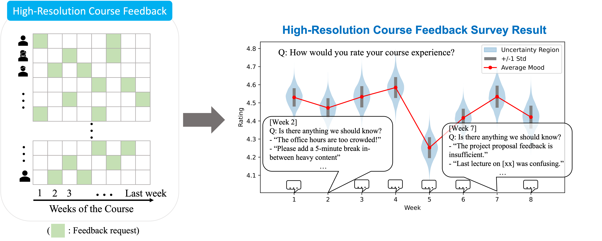

# High-Resolution Course Feedback (HRCF)

This is an implementation of the High-Resolution Course Feedback (HRCF) tool introduced in the paper ["High-Resolution Course Feedback: Timely Feedback Mechanism for Instructors"](https://dl.acm.org/doi/abs/10.1145/3573051.3593391), published in "L@S '23: Proceedings of the Tenth ACM Conference on Learning @ Scale".

## Abstract

>We study the problem of minimizing the delay between when an issue comes up in a course and when instructors get feedback about it. The widespread practice of obtaining midterm and end-of-term feedback from students is suboptimal in this regard, especially for large courses: it over-samples at a specific point in the course and can be biased by factors irrelevant to the teaching process. As a solution, we release High Resolution Course Feedback (HRCF), an open-source student feedback mechanism that builds on a surprisingly simple idea: survey each student on random weeks exactly twice per term. Despite the simplicity of its core idea, when deployed to 31 courses totaling a cumulative 6,835 students, HRCF was able to detect meaningful mood changes in courses and significantly improve timely feedback without asking for extra work from students compared to the common practice. An interview with the instructors revealed that HRCF provided constructive and useful feedback about their courses early enough to be acted upon, which would have otherwise been unobtainable through other survey methods. We also explore the possibility of using Large Language Models to flexibly and intuitively organize large volumes of student feedback at scale and discuss how HRCF can be further improved.



## Overview

The HRCF webapp (under the `/hrcf` directory) is written uising the [React](https://react.dev/) library and uses a [Cloud Firestore](https://firebase.google.com/docs/firestore) database.
- The **Instructors Dashboard** is where the instructors can log in to request HRCF surveys and manage their approved surveys.
- The **Course Settings Page** is where the instructors can update the custom questiosn of the week, student rosters, and the course staff settings.
- The **Feedback Page** is where each individual student can anonymously submit their feedback.

The server-side scripts (under the `/run` directory) are used by the HRCF system admin for scheduling surveys, populating databases, and sending emails. Admin scripts in `/run/admin` are used to approve course surveys and to set the default questions of the week.

## Instructions for Use

Several parts of the code must be filled in or adjusted according to your setup.

### Using the WebApp

1. **Add your Firebase configuration object to `/hrcf/src/firebase/config.js`**: This links the webapp to your Firestore database.
2. **Adjust OAuth Settings to Your Institution**: The instructors are asked to sign in to manage their surveys. The app uses Firebase UI authentication, and the base code is configured to use an email authentication or Google OAuth. We recommend adjusting the sign in options to include the Google OAuth settings for your institution.
```
    const uiConfig = {
      signInOptions: [
        firebase.auth.GoogleAuthProvider.PROVIDER_ID,
        firebase.auth.EmailAuthProvider.PROVIDER_ID
      ],
      signInFlow: 'redirect',
      immediateFederatedRedirect:true
      // Other config options...
    };
```

### Using the Survey Script

1. **Enter Configuration Values in `/run/src/_constants.py`**
```
    HOST_NAME="" # host name for the HRCF app e.g., 'https://www.example.org'
    EMAIL="" # email address used for sending survey requests and reminders
    ADMIN_EMAILS=[] # email addresses of tool admins
    FIREBASE_KEY_PATH="" # absolute path of the firebase JSON certificate key file
    KEYS_PATH="" # absolute path of the directory where all private credential files (e.g., hrcf.txt storing the password to EMAIL) are stored
    TIME_FORMAT="%m/%d/%Y"
    EMAIL_DOMAIN="" # domain of the student emails e.g., "stanford.edu"
    
    ROOT_DIR=os.path.dirname(os.path.dirname(__file__))
    DATA_DIR=os.path.join(ROOT_DIR, 'data')
```
2. **Run Admin Scripts to Set Up**: `/run/admin/set_default_questions.py` is used to add the questions in `/run/data/default_questions.json` as default questions. `/run/admin/add_course.py` is used for approving course survey requests.
3. **Run `monday.py`, `thursday.py`, and `sunday.py` on each specified day of week**: It helps to use a job scheduler (e.g., cron) to do this.
